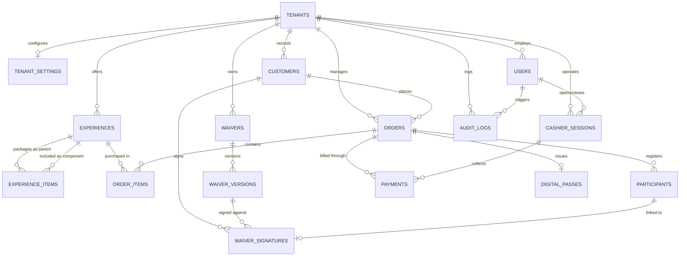

# Database Documentation — AdventureOS (SunKart Park Management System)

Base de datos relacional de nivel comercial diseñada para soportar operaciones multi-empresa (SaaS), control de reservas, waivers digitales con firma electrónica, órdenes, pagos desacoplados (AZUL/Mock), pases QR de alta seguridad y arqueos de caja POS.

## Schema Overview

- **Database Engine**: PostgreSQL / Neon Serverless Postgres
- **ORM**: Prisma Client v5.21+
- **Tenancy Model**: Shared Database, Shared Schema con particionamiento lógico estricto por `tenantId` (Column-level isolation).

---

## Entity-Relationship Model

---

## Data Dictionary

### Table: `tenants`
**Description**: Registra cada empresa o parque recreativo cliente de la plataforma (ej. SunKart Park Punta Cana).

| Column | Type | Constraints | Default | Description |
| :--- | :--- | :--- | :--- | :--- |
| `id` | UUID / String | PK | `uuid()` | Identificador único del tenant |
| `slug` | String | UK, NOT NULL | | Identificador en URL (ej. `sunkart-pc`) |
| `name` | String | NOT NULL | | Nombre comercial del parque |
| `legalName` | String | NULL | | Razón social legal |
| `taxId` | String | NULL | | Identificación tributaria (RNC) |
| `email` | String | NULL | | Correo oficial de contacto |
| `phone` | String | NULL | | Teléfono de atención al cliente |
| `currency` | String | NOT NULL | `'USD'` | Moneda base (`USD`, `DOP`) |
| `timezone` | String | NOT NULL | `'America/Santo_Domingo'` | Zona horaria para reportes |
| `active` | Boolean | NOT NULL | `true` | Estado operativo del tenant |
| `createdAt` | DateTime | NOT NULL | `now()` | Fecha de registro |
| `updatedAt` | DateTime | NOT NULL | auto | Última modificación |

---

### Table: `tenant_settings`
**Description**: Preferencias de personalización visual, reglas fiscales y configuración de pasarela para el tenant.

| Column | Type | Constraints | Default | Description |
| :--- | :--- | :--- | :--- | :--- |
| `id` | UUID / String | PK | `uuid()` | Identificador de configuración |
| `tenantId` | UUID / String | UK, FK -> `tenants.id` | | Relación uno a uno con el tenant |
| `logoUrl` | String | NULL | | URL del logotipo corporativo |
| `primaryColor` | String | NOT NULL | `'#f97316'` | Color primario de marca (HEX) |
| `secondaryColor` | String | NOT NULL | `'#0f172a'` | Color secundario (HEX) |
| `taxRate` | Decimal(4,2) | NOT NULL | `0.18` | Tasa de impuesto ITBIS (18%) |
| `exchangeRate` | Decimal(8,2) | NOT NULL | `60.00` | Tasa de cambio DOP por USD |
| `receiptFooterNote` | Text | NULL | | Mensaje al pie del recibo térmico |
| `demoMode` | Boolean | NOT NULL | `true` | Habilita pagos simulados |

---

### Table: `users`
**Description**: Usuarios internos del sistema con control de acceso basado en roles (RBAC).

| Column | Type | Constraints | Default | Description |
| :--- | :--- | :--- | :--- | :--- |
| `id` | UUID / String | PK | `uuid()` | Identificador de usuario |
| `tenantId` | UUID / String | FK -> `tenants.id`, NULL | | Tenant al que pertenece (NULL = Super Admin) |
| `email` | String | UK, NOT NULL | | Correo electrónico de acceso |
| `passwordHash` | String | NOT NULL | | Hash bcrypt de la contraseña |
| `name` | String | NOT NULL | | Nombre completo del usuario |
| `role` | Role Enum | NOT NULL | `'STAFF'` | `SUPER_ADMIN`, `BUSINESS_ADMIN`, `CASHIER`, `STAFF` |
| `active` | Boolean | NOT NULL | `true` | Permiso de inicio de sesión |
| `lastLoginAt` | DateTime | NULL | | Timestamp de último acceso |

---

### Table: `experiences`
**Description**: Catálogo de actividades recreativas individuales o paquetes combinados de aventuras.

| Column | Type | Constraints | Default | Description |
| :--- | :--- | :--- | :--- | :--- |
| `id` | UUID / String | PK | `uuid()` | Identificador de la experiencia |
| `tenantId` | UUID / String | FK -> `tenants.id` | | Parque dueño de la experiencia |
| `name` | String | NOT NULL | | Nombre público de la actividad |
| `slug` | String | NOT NULL | | Slug URL único por tenant |
| `description` | Text | NOT NULL | | Descripción y especificaciones |
| `price` | Decimal(10,2) | NOT NULL | | Precio unitario base |
| `currency` | String | NOT NULL | `'USD'` | Moneda del precio |
| `durationMinutes` | Int | NULL | | Duración en minutos |
| `minimumAge` | Int | NULL | | Edad mínima requerida |
| `minimumHeightCm`| Int | NULL | | Altura mínima en centímetros |
| `capacity` | Int | NULL | | Capacidad máxima simultánea |
| `waiverRequired` | Boolean | NOT NULL | `true` | Exige firma de waiver previa |
| `isPackage` | Boolean | NOT NULL | `false` | Indica si agrupa múltiples actividades |
| `active` | Boolean | NOT NULL | `true` | Visible en el catálogo |

---

### Table: `waivers` & `waiver_versions`
**Description**: Registro inmutable de textos legales y exenciones de responsabilidad civil.

| Column | Type | Constraints | Default | Description |
| :--- | :--- | :--- | :--- | :--- |
| `id` | UUID / String | PK | `uuid()` | Identificador de versión |
| `waiverId` | UUID / String | FK -> `waivers.id` | | Contrato legal padre |
| `versionNumber` | Int | NOT NULL | `1` | Correlativo de versión (v1, v2...) |
| `legalText` | Text | NOT NULL | | Cláusulas legales exactas |
| `language` | String | NOT NULL | `'es'` | Código de idioma (`es`, `en`) |
| `publishedAt` | DateTime | NOT NULL | `now()` | Fecha de publicación |
| `active` | Boolean | NOT NULL | `true` | Versión actualmente vigente |

---

### Table: `waiver_signatures`
**Description**: Registro legal probatorio de cada firma digital capturada, incluyendo auditoría de tutor para menores.

| Column | Type | Constraints | Default | Description |
| :--- | :--- | :--- | :--- | :--- |
| `id` | UUID / String | PK | `uuid()` | Identificador de firma |
| `versionId` | UUID / String | FK -> `waiver_versions.id` | | Versión legal específica aceptada |
| `participantName` | String | NOT NULL | | Nombre del visitante participante |
| `participantDob` | DateTime | NOT NULL | | Fecha de nacimiento |
| `isMinor` | Boolean | NOT NULL | `false` | Calculado automáticamente (< 18 años) |
| `guardianName` | String | NULL | | Nombre del tutor legal (si es menor) |
| `guardianRelation`| String | NULL | | Parentesco (Madre, Padre, Tutor) |
| `guardianEmail` | String | NULL | | Correo del tutor |
| `guardianPhone` | String | NULL | | Teléfono del tutor |
| `signatureData` | Text | NOT NULL | | Imagen PNG Base64 capturada del canvas |
| `acceptedTerms` | Boolean | NOT NULL | `true` | Checkbox obligatorio aceptado |
| `ipAddress` | String | NULL | | Dirección IP del firmante |
| `userAgent` | String | NULL | | Huella digital de navegador |
| `signedAt` | DateTime | NOT NULL | `now()` | Timestamp UTC de la firma |

---

### Table: `orders` & `order_items`
**Description**: Cabecera y detalle de las transacciones de compra y reservas de visitantes.

| Column | Type | Constraints | Default | Description |
| :--- | :--- | :--- | :--- | :--- |
| `id` | UUID / String | PK | `uuid()` | Identificador de la orden |
| `orderNumber` | String | UK, NOT NULL | | Código amigable (ej. `SK-001042`) |
| `tenantId` | UUID / String | FK -> `tenants.id` | | Parque asociado |
| `customerId` | UUID / String | FK -> `customers.id` | | Comprador principal |
| `subtotal` | Decimal(10,2) | NOT NULL | | Subtotal antes de impuestos |
| `tax` | Decimal(10,2) | NOT NULL | | Impuesto ITBIS (18%) |
| `discount` | Decimal(10,2) | NOT NULL | `0.00` | Descuento aplicado |
| `total` | Decimal(10,2) | NOT NULL | | Monto final a pagar |
| `currency` | String | NOT NULL | `'USD'` | Moneda |
| `orderStatus` | OrderStatus | NOT NULL | `'PENDING_PAYMENT'` | `DRAFT`, `PENDING_PAYMENT`, `PAID`, `CANCELLED`, `COMPLETED` |
| `paymentStatus` | PaymentStatus | NOT NULL | `'UNPAID'` | `UNPAID`, `PENDING`, `AUTHORIZED`, `PAID`, `FAILED` |
| `paymentMethod` | PaymentMethod | NULL | | `ONLINE_CARD`, `CASHIER_CASH`, `CASHIER_CARD_POS`, `MOCK_TEST` |

---

### Table: `digital_passes`
**Description**: Tokens seguros para generación de códigos QR de acceso sin PII (Personally Identifiable Information).

| Column | Type | Constraints | Default | Description |
| :--- | :--- | :--- | :--- | :--- |
| `id` | UUID / String | PK | `uuid()` | Identificador del pase |
| `orderId` | UUID / String | UK, FK -> `orders.id` | | Orden a la que pertenece el pase |
| `passCode` | String | UK, NOT NULL | | Código visible (ej. `SK-PASS-7F82A91D`) |
| `securityToken` | UUID / String | UK, NOT NULL | `uuid()` | Token opaco encriptado dentro del QR |
| `status` | PassStatus | NOT NULL | `'VALID'` | `VALID`, `USED`, `CANCELLED`, `REVOKED` |
| `usedAt` | DateTime | NULL | | Momento exacto de redención en la puerta |
| `validatedBy` | String | NULL | | ID del miembro del Staff que escaneó |

---

### Table: `cashier_sessions`
**Description**: Control de apertura, transacciones y arqueo ciego o conciliado del cajero físico.

| Column | Type | Constraints | Default | Description |
| :--- | :--- | :--- | :--- | :--- |
| `id` | UUID / String | PK | `uuid()` | Identificador del turno de caja |
| `tenantId` | UUID / String | FK -> `tenants.id` | | Parque |
| `userId` | UUID / String | FK -> `users.id` | | Cajero responsable |
| `status` | SessionStatus | NOT NULL | `'OPEN'` | `'OPEN'`, `'CLOSED'` |
| `openedAt` | DateTime | NOT NULL | `now()` | Hora de inicio de turno |
| `closedAt` | DateTime | NULL | | Hora de cierre de caja |
| `openingFloat` | Decimal(10,2) | NOT NULL | `0.00` | Fondo de caja inicial |
| `closingFloat` | Decimal(10,2) | NULL | | Arqueo final contado físicamente |
