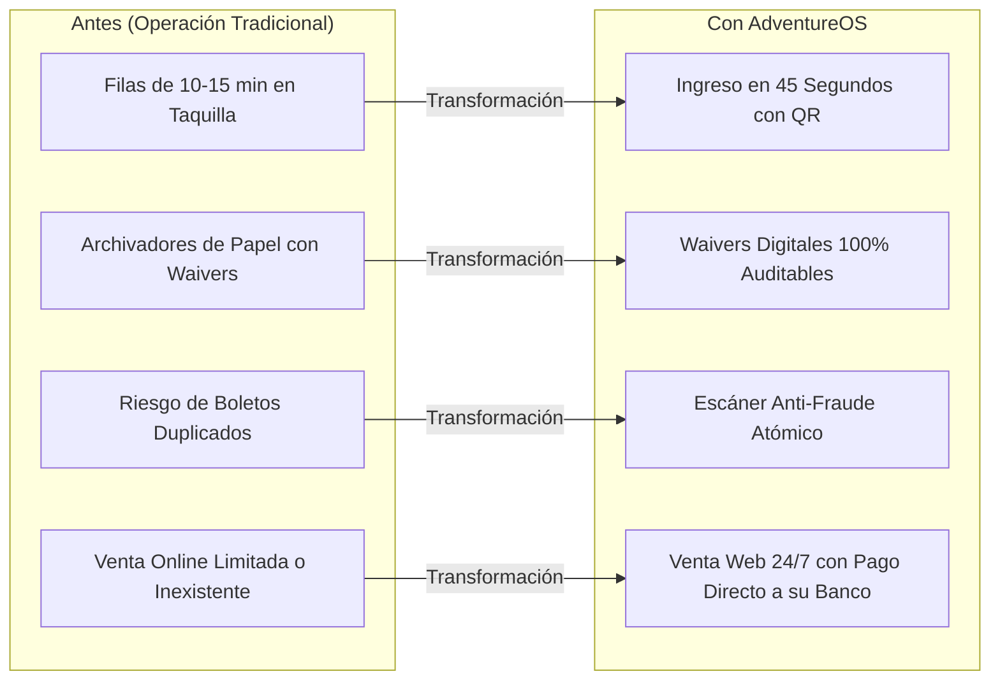
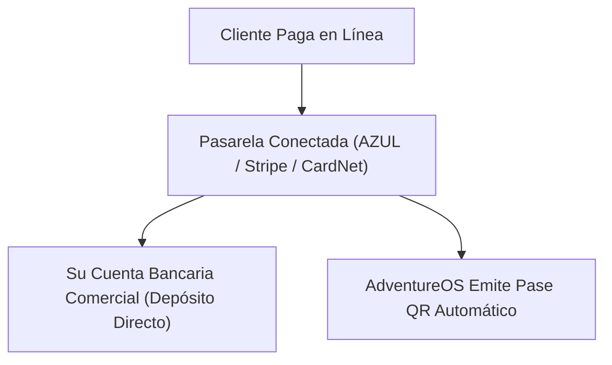

# Propuesta Comercial: Modernización, Ventas Online y Control Operativo
## Solución Integral AdventureOS para Parques de Aventura, Go-Karts y Complejos Recreativos

> **Preparado para:** Dirección General, Gerencia de Operaciones y Dirección Financiera  
> **Asunto:** Propuesta de Implementación de Plataforma Tecnológica Integral (Ventas Online + Waivers Digitales + POS Taquilla + Control de Acceso Anti-Fraude)

---

### Estimado(a) Director(a) / Propietario(a):

Gestionar un centro recreativo de alta afluencia como el suyo presenta desafíos diarios muy específicos: **filas lentas en taquilla que frustran a los clientes, cientos de hojas de papel de descargos de responsabilidad (*waivers*) difíciles de archivar y validar ante un reclamo legal, reingresos no controlados de boletos en pista, y descuadres de caja entre pagos en efectivo y terminales bancarias.**

**AdventureOS** fue concebido y desarrollado para solucionar de manera definitiva estos dolores operativos. 

Le presentamos una plataforma moderna, probada y lista para operar, diseñada para **multiplicar sus ventas anticipadas por internet, reducir en un 90% el tiempo de atención en recepción y blindar legal y financieramente cada metro de su operación.**

---

## 1. El Impacto en su Negocio: ¿Por qué implementar AdventureOS hoy?

| Desafío Actual en su Parque | Cómo lo Resuelve AdventureOS | Beneficio Económico Directo |
| :--- | :--- | :--- |
| **Pérdida de clientes por filas largas en taquilla** | Los clientes compran online, eligen su horario y firman el waiver desde su celular antes de llegar al parque. | **Aumento de ventas**: Clientes que antes se desanimaban por la fila ahora compran con anticipación. |
| **Costo y riesgo legal de waivers en papel** | Firma electrónica en pantalla (móvil o tablet kiosco) con registro forense inmutable (IP, fecha y hora exacta, tutor para menores). | **Cero gasto en papel** y tranquilidad total respaldada ante aseguradoras y litigios legales. |
| **Boletos compartidos o fotocopiados en pista** | Pases digitales con código QR de un solo uso validado atómicamente por los operarios con semáforo óptico instantáneo. | **Cero filtraciones**: Nadie entra a una carrera o actividad sin que el sistema valide el pago. |
| **Descuadres en caja al final del turno** | Módulo de Punto de Venta (POS) con apertura formal de fondo de caja (*opening float*), calculadora de cambio y arqueo ciego. | **Control total del dinero**: Cada peso y dólar queda registrado y cuadrado por cajero. |

---

## 2. La Experiencia para sus Visitantes (Vender más y mejor)

Su cliente no quiere llenar formularios en un mostrador; quiere divertirse. AdventureOS le ofrece una experiencia de compra de primer nivel:

1. **Catálogo Visual de Experiencias y Paquetes**: Presentación limpia de sus disciplinas (Go-Karts, Paintball, Circuitos Aéreos, Combos Multiaventura) con tarifas individuales y paquetes cerrados para grupos y familias (*Crew 5*, *Battle 10*, *Triple Pass*).
2. **Registro Anticipado de Participantes**: En compras grupales, el cliente asigna los nombres de sus acompañantes desde la web, ahorrándole a su personal de recepción la captura manual de datos.
3. **Bilingüe Nativo (Español / Inglés)**: Indispensable si recibe turismo internacional. El visitante cambia de idioma en un clic y todo el catálogo, descargo legal y checkout se adapta al instante.
4. **Claridad Impositiva Total**: Impuestos locales (ITBIS 18%) claramente desglosados para evitar fricciones al momento de pagar.

---

## 3. Control Operativo y de Seguridad para su Personal

AdventureOS entrega a su equipo herramientas intuitivas que no requieren semanas de capacitación:

### A) Taquilla y Recepción (Módulo Cajero POS)
- **Búsqueda Instantánea en 1 Segundo**: Si el cliente llega con su código de reserva o nombre, el cajero lo localiza al instante en pantalla.
- **Cobro Flexible**: Opción de pagar con tarjeta física en su terminal bancario o en efectivo con calculadora de cambio automático.
- **Impresión de Ticket Térmico de 80mm**: Impresión profesional inmediata de recibos y vouchers para entregar al cliente en formato estándar de punto de venta.
- **Control de Turnos**: Arqueo de efectivo y cobros con tarjeta por sesión de caja para auditoría transparente.

### B) Control en Pista y Atracciones (Módulo Escáner Staff)
- **Escaneo Rápido con Smartphone o Lector 2D**: El operario apunta al QR del pase del visitante.
- **Semáforo Óptico Gigante**: Pantalla en Verde (Aprobado), Rojo (Ya usado / Inválido) y Ámbar (En espera). Diseñado especialmente para exteriores y luz solar.
- **Bloqueo Atómico Anti-Fraude**: Si dos amigos intentan canjear una captura de pantalla del mismo pase al mismo tiempo, el sistema valida uno y bloquea automáticamente el segundo en milisegundos.

### C) Dirección y Gerencia (Panel Administrativo en Vivo)
- **Métricas Clave en Tiempo Real**: Total recaudado hoy, órdenes procesadas, afluencia de participantes y waivers completados.
- **Conversión de Divisas Automática**: Reportes unificados en Dólares (USD) y Pesos Dominicanos (DOP).
- **Gestión de Catálogo**: Suba o pause experiencias y actualice precios con vigencia inmediata.

---

## 4. Cobros y Pasarelas de Pago: El Dinero va Directo a su Cuenta

Usted mantiene el control total de sus finanzas. AdventureOS no retiene su dinero ni actúa como intermediario; **los fondos se acreditan directamente en las cuentas bancarias de su empresa**:

### Integraciones Disponibles:
- **República Dominicana (Local)**:
  - **AZUL (Banco Popular)**: Integración oficial con Hosted Checkout y protocolo de seguridad 3DSecure 2.0 con firma criptográfica HMAC-SHA512. Depósitos en DOP o USD en su cuenta local.
  - **CardNet / Carnet**: Conexión con adquirencia local para aceptación masiva de tarjetas dominicanas e internacionales.
- **Internacional**:
  - **Stripe**: Cobros instantáneos con Apple Pay, Google Pay y tarjetas Visa, Mastercard y American Express de todo el mundo.
  - **PayPal**: Ideal para captar reservas anticipadas de turistas extranjeros antes de que viajen a su destino.
- **En Sitio (Taquilla)**:
  - Terminales físicas (*Verifone / Ingenico / CardNet / AZUL POS*) y control de cobro en efectivo.

---

## 5. Propuesta Económica y Opciones de Inversión

Presentamos dos esquemas comerciales claros, sin costos ocultos, estructurados para adaptarse al modelo financiero y flujo de caja de su complejo:

### 5.1. Comparativa de Planes y Precios

| Concepto / Módulo | Opción A: Plan Cloud SaaS *(Recomendado)* | Opción B: Licencia Empresarial *(Propiedad)* |
| :--- | :---: | :---: |
| **Cuota de Implementación & Setup Inicial** *(Pago único)* | **US$ 1,200** *(~RD$ 72,000)* | **US$ 6,800** *(~RD$ 408,000)* |
| **Cuota de Servicio Mensual** | **US$ 290 / mes** *(~RD$ 17,400)* | **US$ 0 / mes** |
| **Pases Digitales QR y Waivers** | Ilimitados | Ilimitados |
| **Usuarios y Cajas POS** | Ilimitados | Ilimitados |
| **Servidores Cloud, SSL y Base de Datos** | Incluido | Gestionado por el cliente |
| **Equipamiento Físico (Hardware)** | No incluido | No incluido |
| **Propiedad del Código Fuente** | No (Licencia por uso) | **Sí (Código entregado)** |
| **Soporte Técnico y Actualizaciones** | 24/7 Continuo incluido | 90 días incluidos (luego opcional) |

---

### 5.2. Análisis de Retorno de Inversión (ROI Mensual): ¿Por qué la solución se paga sola?

Con un flujo moderado de 800 a 1,500 visitantes al mes, el ahorro directo y la recuperación de ingresos superan con holgura la inversión:

| Concepto de Ahorro / Recuperación | Cálculo Estimado Mensual | Retorno Estimado para su Parque |
| :--- | :--- | :---: |
| **Ahorro en papel, tóner y archivadores de waivers** | ~1,200 hojas impresas, carpetas y tiempo de archivo manual | **+ US$ 350 / mes** |
| **Eliminación de fraude y boletos duplicados en pista** | Recuperación de un 2% de entradas filtradas por reingresos no controlados | **+ US$ 720 / mes** |
| **Incremento en ticket promedio por venta online previa** | Paquetes cerrados grupales (*Crew 5*, *Triple Pass*) comprados con anticipación | **+ US$ 1,100 / mes** |
| **Reducción de personal extra en taquilla en horas pico** | Descongestión del 90% de la fila mediante pre-check-in digital | **+ US$ 400 / mes** |
| **Beneficio Neto Mensual Estimado** | Ingresos adicionales y ahorros generados | **+ US$ 2,570 / mes** |
| **Costo del Software (Plan SaaS)** | Cuota de servicio mensual | **- US$ 290 / mes** |
| **Ganancia Neta Mensual para su Parque** | **Retorno Positivo desde el Mes 1** | **+ US$ 2,280 / mes** |

---

### 5.3. Condiciones Comerciales y Forma de Pago

- **Moneda de Cotización**: Valores expresados en Dólares Estadounidenses (USD) o pagaderos en Pesos Dominicanos (DOP) calculados a la tasa de cambio oficial del Banco Central de la República Dominicana al momento de la facturación.
- **Forma de Pago de Implementación**:
  - **50% de Anticipo**: A la firma de la orden de servicio y entrega del cronograma de despliegue.
  - **50% Restante**: Contra entrega del sistema en vivo y finalización de la capacitación del personal (Fase 4).
- **Validez de la Oferta**: Esta cotización económica se mantiene garantizada por **30 días calendario** a partir de la fecha de entrega.
- **Garantía de Satisfacción Operativa**: Incluye acompañamiento técnico presencial o remoto dedicado durante el primer fin de semana completo de operación con público para garantizar cero incidencias en taquilla y pista.

---

## 6. Cronograma de Implementación (En Marcha en 3 Semanas)

No interferimos con el funcionamiento diario de su parque. La puesta en marcha se realiza en paralelo:

| Etapa | Plazo | Entregables |
| :--- | :---: | :--- |
| **Fase 1: Configuración y Marca** | Días 1 a 5 | Carga de catálogo con fotos y tarifas, personalización de colores/logos y redacción de waiver legal adaptado a sus pólizas de seguro. |
| **Fase 2: Conexión Bancaria** | Días 6 a 10 | Conexión con sus credenciales de AZUL, CardNet o Stripe; pruebas de cobro real y simulado en ambiente seguro. |
| **Fase 3: Capacitación de Personal** | Días 11 a 15 | Talleres prácticos de 30 minutos con cajeros (POS) y operarios (Escáner). Pruebas de estrés de taquilla. |
| **Fase 4: Lanzamiento en Vivo** | Día 16 en adelante | Apertura del sistema al público con acompañamiento y monitoreo técnico en tiempo real durante su fin de semana de mayor afluencia. |

---

## 7. Próximo Paso Recomendado

Para que su equipo evalúe la fluidez y velocidad del sistema en un entorno real:

1. **Demostración Interactiva en Vivo (20 minutos)**: Navegaremos juntos por el catálogo, realizaremos una compra de prueba, firmaremos un waiver desde el celular y validaremos el pase en el escáner de pista.
2. **Propuesta Económica Personalizada**: Con base en el número de atracciones y volumen promedio de visitantes de su parque, estructuraremos la cotización más rentable para su empresa.

---

**AdventureOS — Tecnología que Acelera su Parque.**  
*Quedamos a su entera disposición para coordinar la sesión demostrativa en el día y horario que mejor convenga a su agenda.*
