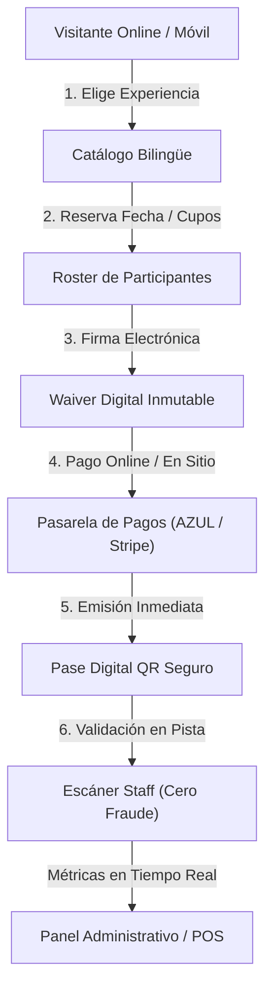

# Propuesta Comercial & Ficha de Producto: AdventureOS
## Plataforma Integral de Gestión, Venta y Control de Acceso para Parques de Aventura, Go-Karts y Centros Recreativos

---

## 1. Resumen Ejecutivo (Executive Summary)

**AdventureOS** es una solución tecnológica integral de grado empresarial diseñada específicamente para modernizar, automatizar y maximizar la rentabilidad de parques de diversiones, circuitos de go-karts, campos de paintball, parques de tirolesa y centros de entretenimiento de alto tráfico.

La plataforma resuelve de raíz los tres mayores cuellos de botella de la industria recreativa:
1. **Pérdida de ventas por procesos manuales**: Catálogo online optimizado para conversión con reservas anticipadas y pagos inmediatos.
2. **Filas y congestión en taquilla**: Registro anticipado de participantes, emisión de pases digitales QR y exenciones de responsabilidad (*waivers*) 100% digitales.
3. **Riesgo legal y fraude operativo**: Control criptográfico anti-reutilización de entradas (*anti double-spending*), firma electrónica legal inmutable y cuadre ciego de cajas de punto de venta (POS).



---

## 2. Capacidades Principales del Software

### 2.1. Funnel de Ventas y Reservas para Visitantes (B2C)
- **Catálogo Interactivo y Paquetes Cerrados**: Presentación visual en cuadrícula de experiencias individuales, pases múltiples (*Triple Pass*) y paquetes grupales (*Crew 5*, *Battle 10*, etc.).
- **Flujo Guiado Paso a Paso**: Selección deliberada de experiencias con confirmación explícita mediante botones de avance que evitan saltos abruptos en el checkout.
- **Roster Dinámico de Participantes**: Ajuste automático del número de participantes según el paquete contratado, permitiendo ingresar nombres y roles antes de llegar a la pista.
- **Soporte Bilingüe Nativo (Español / Inglés)**: Conmutación instantánea en tiempo real sin recarga de página, ideal para centros turísticos internacionales.
- **Gestión Impositiva Automática**: Cumplimiento fiscal con ITBIS (18%) o impuestos locales integrados en el precio o discriminados según la normativa tributaria.

### 2.2. Motor de Waivers Digitales & Firma Electrónica
- **Firma Interactiva en Canvas HTML5**: Captura de trazo digital fluida tanto en smartphones como en tablets de kiosco en recepción.
- **Protección a Menores de Edad**: Detección algorítmica de edad con campos obligatorios para tutor legal o adulto responsable.
- **Auditoría Forense Inmutable**: Almacenamiento del texto legal de la versión aceptada, IP de origen, huella de navegador (*User-Agent*) y marca de tiempo certificada (ISO 8601).
- **Ahorro 100% en Papel y Archivo Físico**: Eliminación total de archivadores físicos y búsqueda instantánea de consentimientos ante contingencias legales o reclamos de aseguradoras.

### 2.3. Control de Acceso y Validación de Pases QR (Staff)
- **Pases Digitales Zero-PII**: Códigos QR de alta densidad sin datos personales expuestos (*privacy by design*), encriptados con tokens alfanuméricos seguros.
- **Tecnología Anti-Doble Canje (*Anti Double-Spending*)**: Transacciones atómicas a nivel de base de datos que impiden el canje simultáneo o fotocopiado de un mismo pase.
- **Interfaz de Pista Óptica Gigante**: Semáforo visual en pantalla completa (Verde = Aprobado, Rojo = Inválido/Ya Usado, Ámbar = Esperando) diseñado para operarios en ambientes exteriores con luz solar directa o reflejos.

### 2.4. Punto de Venta (POS) y Caja en Recepción
- **Búsqueda Instantánea Omnicanal**: Localización de reservas en milisegundos mediante escaneo de QR, código de orden o nombre del cliente.
- **Control de Sesiones de Caja**: Flujo formal de apertura con fondo de caja (*opening float*), registro de cobros en efectivo con calculadora de cambio y cierre de turno con arqueo.
- **Impresión de Recibos Térmicos de 80mm**: Salida directa formateada con `@media print` para impresoras térmicas estándar (Epson, Star Micronics, Bixolon) con desglose impositivo y código de voucher.

### 2.5. Panel de Control y Analítica Administrativa
- **Métricas Operativas en Tiempo Real**: Ingresos del día, número de órdenes procesadas, afluencia de participantes y tasa de cumplimiento de waivers.
- **Conversión Multidivisa en Vivo**: Visualización unificada de métricas operativas en Dólares Estadounidenses (USD) y Pesos Dominicanos (DOP).
- **Gestión de Catálogo**: Capacidad de activar/pausar experiencias y modificar precios de forma inmediata.

---

## 3. Integraciones de Pago y Flexibilidad Financiera

AdventureOS fue desarrollado con una arquitectura modular desacoplada (`IPaymentProvider`), lo que permite conectar cualquier pasarela bancaria sin rehacer el sistema:

| Proveedor / Método | Tipo de Integración | Mercado Objetivo | Características |
| :--- | :--- | :--- | :--- |
| **AZUL (Banco Popular)** | API / Hosted Checkout 3DS | República Dominicana | Autenticación criptográfica HMAC-SHA512 (`AuthHash`), cumplimiento 3D-Secure 2.0 y acreditación local directa en DOP/USD. |
| **CardNet / Carnet** | Webhook / Hosted Page | Caribe & Centroamérica | Aceptación de tarjetas locales e internacionales con tokenización segura. |
| **Stripe** | Stripe Elements / Checkout | Internacional / Global | Pagos instantáneos con Apple Pay, Google Pay y tarjetas de crédito globales en más de 135 divisas. |
| **PayPal Commerce** | Smart Payment Buttons | Turistas Internacionales | Pago mediante billetera digital PayPal para visitantes extranjeros sin tarjeta a mano. |
| **Cobro Físico POS / Efectivo** | Integración Terminal en Sitio | Recepción / Taquilla | Marcación de orden como pagada en sitio con registro de transacción física y arqueo de caja. |

> **Modo Demostración / Alta Disponibilidad (Failover Activo):** La plataforma incluye un motor Mock integrado que permite procesar ventas en modo simulación para entrenamiento del personal o contingencia operativa cuando las telecomunicaciones externas presenten fallas.

---

## 4. Controles Operativos, Seguridad y Auditoría

1. **Aislamiento Multi-Tenant**: Base de datos estructurada con partición lógica por parque (`TenantId`), permitiendo a una cadena operar múltiples sedes con inventarios, configuraciones y usuarios independientes.
2. **Seguridad Basada en Roles (RBAC)**:
   - `SUPERADMIN`: Control global de configuración y finanzas.
   - `ADMIN`: Gestión de catálogo, métricas y reportes del parque.
   - `CASHIER`: Cobros en taquilla, búsqueda de órdenes y arqueo de caja.
   - `OPERATOR`: Validación exclusiva de pases QR en pista (sin acceso a datos financieros).
3. **Cero Caídas en Producción**: Arquitectura Next.js App Router optimizada para despliegue *Edge / Serverless* (Vercel, AWS Lambda) con compatibilidad de bases de datos serverless (Neon Postgres, Supabase).
4. **Cumplimiento y Trazabilidad Legal**: Cada firma digital almacena metadatos forenses listos para exportación pericial en caso de incidentes en pista.

---

## 5. Modelos de Venta y Comercialización

Se proponen tres modalidades comerciales flexibles según el perfil del cliente:

### Modalidad A: Software as a Service (SaaS Recurrente)
*Ideal para parques que buscan bajo costo inicial y soporte continuo.*
- **Setup inicial**: Implementación, carga de catálogo e inducción de personal.
- **Mensualidad fija**: Acceso completo a la plataforma, hosting serverless y actualizaciones de seguridad.
- **Comisión por transacción online**: Porcentaje reducido sobre reservas procesadas a través de la web.

### Modalidad B: Licencia Empresarial (White-Label / On-Premise)
*Ideal para cadenas de entretenimiento o franquicias que desean propiedad sobre su stack.*
- **Venta de código fuente o licencia perpetua**: Despliegue en la nube del cliente (AWS, Vercel, Azure o servidor propio).
- **Personalización de identidad gráfica completa**: Dominio propio, logotipos y personalización a medida.
- **Contrato de soporte y mantenimiento anual opcional**.

### Modalidad C: Llave en Mano con Hardware (Kioscos y Taquilla)
*Solución completa que incluye software + equipamiento físico.*
- Software AdventureOS preinstalado.
- Tablets de uso rudo para estación de firma digital de waivers.
- Escáneres ópticos 2D para operarios de pista.
- Impresoras térmicas de recibos de 80mm preconfiguradas para taquilla.

---

## 6. Retorno de Inversión Estimado (ROI)

| Métrica Operativa | Antes de AdventureOS | Con AdventureOS | Impacto |
| :--- | :--- | :--- | :--- |
| **Tiempo de taquilla por grupo** | 8 a 12 minutos | 45 segundos | **-90% de tiempo en fila** |
| **Pérdida por fraude o doble uso** | 3% - 5% de entradas | 0% (bloqueo atómico) | **Recuperación directa de ingresos** |
| **Costo de papel e impresión de waivers** | US$ 300 - 800 / mes | US$ 0 | **100% ahorro ecológico y operativo** |
| **Venta anticipada online** | < 10% del total | 35% - 55% del total | **Mayor flujo de caja antes de la visita** |

---

## 7. Plan de Implementación (Roadmap de Despliegue)

```
Semana 1: Configuración de Tenant, catálogo y personalización de marca.
Semana 2: Vinculación con pasarela de pagos (AZUL / Stripe) y pruebas en Sandbox.
Semana 3: Capacitación al equipo de recepción (POS) y operarios de pista (Escáner).
Semana 4: Lanzamiento en vivo con acompañamiento técnico presencial o remoto.
```

---

*Documento preparado como propuesta comercial y técnica. Para demostraciones en vivo o cotización formal adaptada a las necesidades de su complejo recreativo, contáctenos.*
